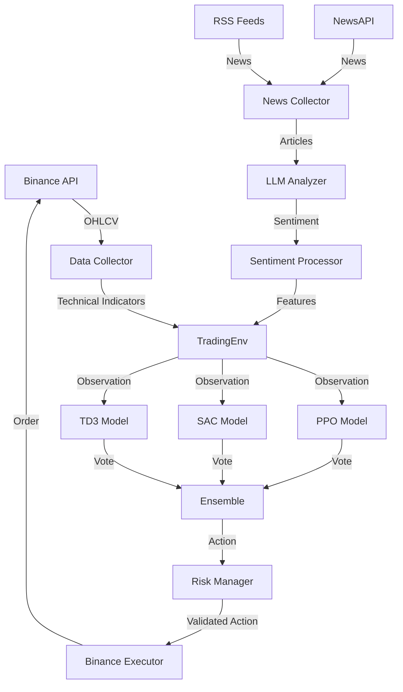

# 🏗️ Arquitetura do Sistema: Ensemble RL + LLM

## 📐 Visão Geral

Sistema de trading automatizado combinando:
- **3 algoritmos RL** trabalhando em conjunto (ensemble)
- **Análise de sentimento** via LLM em notícias
- **Gestão de risco** avançada
- **Execução automática** 24/7

---

## 🔧 Componentes Principais

### **1. Data Pipeline**

```
NewsAPI/RSS → LLM Analyzer → Sentiment Processor → Features
                                                      ↓
Binance API → Data Collector → Technical Indicators → Features
                                                      ↓
                                                 Observation
```

#### Arquivos:
- `src/data/data_collector.py` - Coleta OHLCV + indicadores técnicos
- `src/sentiment/news_collector.py` - Coleta notícias de múltiplas fontes
- `src/sentiment/llm_analyzer.py` - Analisa sentimento com GPT/Claude/FinBERT
- `src/sentiment/sentiment_processor.py` - Transforma sentimento em features numéricas

**Features Totais:**
- Market: ~20 features (OHLCV + RSI, SMA, MACD, BBANDS)
- Sentiment: 9 features (sentimento 1h/6h/24h, trend, volatility, confidence, ratios)
- Portfolio: 3 features (balance, position, equity)
- **Total: 32+ features por timestep**

---

### **2. RL Environment**

```python
TradingEnv (Gymnasium)
├── Observation Space: (50, 32+) → 50 timesteps × 32+ features
├── Action Space: Discrete(3) → [0: Flat, 1: Long, 2: Short]
└── Reward: PnL - commission - drawdown_penalty
```

#### Arquivo:
- `src/environment/trading_env.py`

**Melhorias:**
- ✅ Suporta features de sentimento opcionais
- ✅ Carrega de DataFrame ou arquivo
- ✅ Configurável via dict
- ✅ Normalização automática

---

### **3. Ensemble Training**

```
PPO Training (Stable) → best_model.zip
                              ↓
SAC Training (Aggressive) → best_model.zip  → Ensemble Model
                              ↓
TD3 Training (Continuous) → best_model.zip
```

#### Arquivos:
- `src/training/ensemble_trainer.py` - Treina os 3 modelos
- `src/training/train.py` - Treina modelo único (legado)

**Algoritmos:**

| Algoritmo | Tipo | Melhor Para | Hiperparâmetros |
|-----------|------|-------------|-----------------|
| **PPO** | On-policy | Estabilidade | lr=3e-4, n_steps=2048 |
| **SAC** | Off-policy | Trading contínuo | lr=3e-4, buffer=100k |
| **TD3** | Off-policy | Ações contínuas | lr=1e-3, policy_delay=2 |

**Treinamento:**
- Sequencial: PPO → SAC → TD3
- Callbacks: EvalCallback (valida a cada 10k steps), CheckpointCallback (salva a cada 50k)
- Tensorboard: Logs em `logs/ensemble/`
- Modelos: Salvos em `models/ensemble/{algo}/`

---

### **4. Ensemble Voting**

```python
Observation → PPO.predict() → vote_ppo
           → SAC.predict() → vote_sac  → Combiner → Final Action
           → TD3.predict() → vote_td3
```

#### Arquivo:
- `src/models/ensemble_model.py`

**Estratégias de Votação:**

1. **Majority** - Ação mais votada
2. **Weighted** - Ponderado por pesos fixos (padrão)
3. **Confidence** - Ponderado por confiança do modelo
4. **Best** - Usa apenas modelo com melhor histórico
5. **Average** - Média das previsões

**Exemplo:**
```python
PPO: Long (confidence: 0.7)
SAC: Long (confidence: 0.9)
TD3: Flat (confidence: 0.6)

# Weighted (pesos: PPO=0.3, SAC=0.4, TD3=0.3)
Long: 0.3*0.7 + 0.4*0.9 = 0.57
Flat: 0.3*0.6 = 0.18
→ Final: Long
```

---

### **5. Sentiment Analysis Pipeline**

```
CoinTelegraph RSS ─┐
CoinDesk RSS ───────┤
NewsAPI ────────────┼→ News Collector → Articles
Decrypt RSS ────────┘                      ↓
                                    LLM Analyzer (GPT/Claude/FinBERT)
                                           ↓
                                    [sentiment_score, confidence, reasoning]
                                           ↓
                                    Sentiment Processor
                                           ↓
                         [sentiment_1h, sentiment_6h, sentiment_24h,
                          trend, volatility, confidence,
                          bullish_ratio, bearish_ratio, news_volume]
```

#### Arquivos:
- `src/sentiment/news_collector.py`
- `src/sentiment/llm_analyzer.py`
- `src/sentiment/sentiment_processor.py`

**LLM Prompt (Resumido):**
```
Analise esta notícia sobre criptomoedas:
[título e conteúdo]

Retorne JSON:
{
  "sentiment": "very_bearish|bearish|neutral|bullish|very_bullish",
  "confidence": 0.0-1.0,
  "reasoning": "explicação",
  "topics": ["lista", "de", "tópicos"]
}
```

**Fallback:** Se APIs falharem → FinBERT local (grátis)

---

### **6. Risk Management**

```python
Agent Decision → Risk Manager → [APPROVE / BLOCK]
                      ↓
            - Kelly Criterion position sizing
            - Stop Loss validation
            - Take Profit validation
            - Max Drawdown check
                      ↓
                  Execute Trade
```

#### Arquivo:
- `src/risk/risk_manager.py`

**Regras:**
- Kelly Criterion: `kelly_pct = (W*P - L)/P * fraction (0.25)`
- Stop Loss: 2% padrão
- Take Profit: 4% padrão
- Max Drawdown: 15%
- Max Leverage: 3x

**Pode bloquear ação do agente se violar limites!**

---

### **7. Execution**

```
Main Loop (60s interval)
    ↓
1. Collect Market Data (OHLCV + indicators)
    ↓
2. Collect Sentiment (news → LLM → features)
    ↓
3. Combine → Observation
    ↓
4. Ensemble Prediction (PPO + SAC + TD3 → vote)
    ↓
5. Risk Validation
    ↓
6. Execute on Binance (paper or live)
    ↓
7. Log metrics
    ↓
Repeat
```

#### Arquivo:
- `src/execution/ensemble_executor.py`

**Modos:**
- **Paper Trading:** Simula trades sem gastar dinheiro
- **Live Trading:** Executa ordens reais na Binance

---

## 📊 Métricas e Logging

### **Durante Treinamento:**
```
PPO:
- reward/mean
- policy_loss
- value_loss
- entropy
```

### **Durante Trading:**
```json
{
  "timestamp": "2026-01-04T15:30:00",
  "iteration": 42,
  "sentiment": {
    "score_1h": 0.654,
    "news_count": 23,
    "confidence": 0.82
  },
  "ensemble": {
    "votes": {"ppo": 1, "sac": 1, "td3": 0},
    "final_action": 1,
    "agreement": 0.667
  },
  "price": 94523.45,
  "position": "Long",
  "balance": 10234.56,
  "pnl_open": 0.0123
}
```

### **Resumo Final:**
```
Balance Final: $10,567.89
PnL Total: $567.89
Total Trades: 24
Wins: 15 | Losses: 9
Win Rate: 62.5%
Sharpe Ratio: 1.8
Max Drawdown: 8.2%
```

---

## 🔄 Fluxo de Dados Completo



---

## 🎯 Features Inovadoras

### **1. Sentimento Temporal**
- Não usa apenas sentimento atual
- Calcula tendência (1h vs 24h)
- Detecta volatilidade de sentimento
- Peso temporal (notícias recentes > antigas)

### **2. Ensemble Adaptativo**
- Pesos podem ser ajustados dinamicamente
- Estatísticas de performance por modelo
- Pode favorecer modelo que está acertando mais

### **3. Fallback Inteligente**
- Se GPT/Claude falhar → FinBERT local
- Se NewsAPI falhar → RSS feeds
- Sistema continua funcionando mesmo com APIs offline

### **4. Multi-timeframe**
- Sentimento: 1h, 6h, 24h
- Indicadores: Múltiplos períodos (SMA 20/50, etc)
- Captura tendências de curto e longo prazo

---

## 🧪 Testes e Validação

### **Backtest:**
```python
# Teste histórico sem risco
from src.training.ensemble_trainer import EnsembleTrainer

trainer = EnsembleTrainer()
results = trainer.evaluate_ensemble(
    test_data_path='data/market_data_test.csv',
    episodes=100
)

# Métricas:
# - Mean reward
# - Std reward
# - Win rate
# - Sharpe ratio
```

### **Paper Trading:**
```python
# Teste em tempo real sem risco
from src.execution.ensemble_executor import EnsembleExecutor

executor = EnsembleExecutor()
executor.run(duration_hours=24)
```

### **Ablation Studies:**
1. **Ensemble vs Single:** Treina PPO sozinho, compara com ensemble
2. **Com vs Sem Sentimento:** Desabilita sentiment, mede diferença
3. **Estratégias de Votação:** Testa majority vs weighted vs confidence

---

## 📈 Melhorias Futuras

### **Curto Prazo:**
- [ ] Dashboard Streamlit em tempo real
- [ ] Alertas via Telegram
- [ ] Auto-retreinamento semanal

### **Médio Prazo:**
- [ ] Hyperparameter optimization (Optuna)
- [ ] Mais fontes de sentimento (Twitter, Reddit)
- [ ] Position sizing dinâmico (aprendido pelo RL)

### **Longo Prazo:**
- [ ] Multi-asset trading (BTC, ETH, SOL)
- [ ] Meta-learning (aprende a aprender)
- [ ] Integração com Freqtrade para produção

---

## 🔐 Segurança

### **API Keys:**
- ✅ Armazenadas em `.env` (não commitado)
- ✅ Carregadas via `python-dotenv`
- ✅ Nunca hardcodadas

### **Trading:**
- ✅ Testnet por padrão
- ✅ Paper trading antes de live
- ✅ Stop loss automático
- ✅ Max drawdown protection

### **Dados:**
- ✅ Validação de inputs
- ✅ Normalização automática
- ✅ Tratamento de exceções

---

## 📚 Dependências Core

```
Reinforcement Learning:
- gymnasium (environment)
- stable-baselines3 (PPO, SAC, TD3)
- sb3-contrib (extras)

Trading:
- ccxt (exchange API)
- pandas-ta (indicators)

LLM:
- openai (GPT)
- anthropic (Claude)
- transformers (FinBERT)

Sentiment:
- newsapi-python
- feedparser
- beautifulsoup4

Utilities:
- pandas, numpy
- torch (backend)
- tensorboard (logging)
```

---

## 🎓 Aprendizado Contínuo

O sistema **aprende continuamente**:

1. **Treina offline** com dados históricos
2. **Executa online** com dados reais
3. **Coleta experiências** (trades, PnL, sentimento)
4. **Retreina periodicamente** com novos dados
5. **Ajusta pesos** do ensemble baseado em performance

---

**Sistema pronto para pesquisa e trading automatizado! 🚀**
